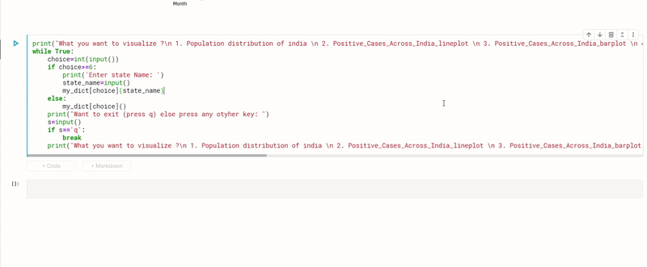
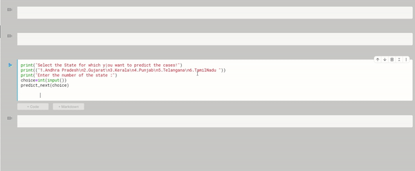

# EY Techathon 2021

## Theme : Monitoring Covid-19 vaccine efficacy using AI

### Customized EDA 
Custom visualization script which allows user to analyse the covid 19 data be it state wise or of entire country.\
Visualization options available
- Population_plot
- Positive Cases Across India line plot,
- Positive Cases Across India barplot,
- Death Trend Across India line plot,
- Death Trend Across India barplot,
- State Wise Positive Cases Analysis line plot,
- State Wise Positive Cases Analysis,
- State Wise Death Analysis,
- Population vs positive cases State Wise
👇👇👇👇👇👇👇

### Customized Forecasting for +ve Covid-19 Cases in states
Users can select state for which they want to forecast covid +ve cases.  
👇👇👇👇👇👇👇

